# 闲鱼助手 - 关键后端业务逻辑链流程详解

> 基于 `com.feijimiao.xianyuassistant` 代码库分析，完整梳理类调用链、方法签名和业务流程

---

## 一、整体架构：Spring 事件驱动模型

### 1.1 消息接收入口

系统通过 WebSocket 长连接接收闲鱼服务端的消息推送，解析后通过 Spring `ApplicationEvent` 广播，多个 `@EventListener` 异步并行处理。

```
com.feijimiao.xianyuassistant.service.impl.WebSocketServiceImpl
  └── 维护 N 个 XianyuWebSocketClient（每个闲鱼账号一个长连接）
       └── 收到消息 → DefaultWebSocketMessageHandler.handleMessage()
            └── WebSocketMessageRouter.route() → 按 lwp 路径分发
                 └── SyncMessageHandler（/s/para、/s/sync）
                      ├── parseMessage() → 解密+解析JSON → 构建 XianyuChatMessage
                      └── publishChatMessageReceivedEvent() → ApplicationContext.eventPublisher
```

### 1.2 事件广播与异步监听

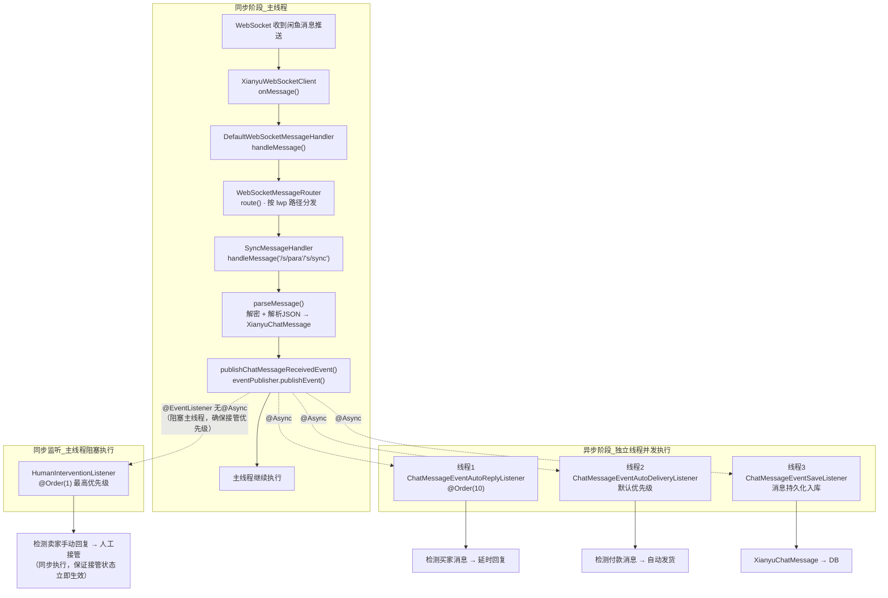

### 1.3 核心类关系

| 层级 | 类名（完整路径） | 作用 |
|------|---------|------|
| **WebSocket客户端** | `websocket.XianyuWebSocketClient` | 单账号长连接，接收/发送消息 |
| **消息路由** | `websocket.WebSocketMessageRouter` | 根据 lwp 路径分发到对应的 LwpHandler |
| **消息处理器接口** | `websocket.WebSocketMessageHandler` | 消息处理接口定义 |
| **同步消息处理器** | `websocket.handler.SyncMessageHandler` | `/s/para` `/s/sync` 解析+解密+发布事件 |
| **事件类** | `event.chatMessageEvent.ChatMessageReceivedEvent` | 继承 `ApplicationEvent`，携带 `ChatMessageData` |
| **事件数据** | `event.chatMessageEvent.ChatMessageData` | 包含 contentType、sId、xyGoodsId、msgContent 等字段 |
| **异步配置** | `config.AsyncConfig` | 配置异步线程池 |

---

## 二、自动回复（Auto Reply）完整链路

### 2.1 类调用链总览

```
ChatMessageEventAutoReplyListener.handleChatMessageReceived()
  ├─→ AccountService.getXianyuUserId(accountId)         // 获取自己的闲鱼用户ID
  ├─→ HumanTakeoverManager.isTakenOver(accountId, sId)   // 检查是否人工接管
  ├─→ AutoReplyService.isAutoReplyEnabled(accountId, xyGoodsId) // 检查回复开关
  └─→ AutoReplyDelayService.submitDelayTask(messageData) // 提交延时任务
       │
       ├─→ HumanTakeoverManager.isTakenOver(accountId, sId)  // 防线1：接管中不提交
       ├─→ ReplyConfigProvider.getDelaySeconds(accountId, xyGoodsId) // 获取延时秒数
       ├─→ cancelDelayTask(accountId, sId)                     // 取消旧延时任务
       ├─→ pendingMessages.compute()                           // 追加消息到待处理列表
       └─→ scheduler.schedule(() -> {                          // 提交 ScheduledFuture
            │
            ├─→ HumanTakeoverManager.isTakenOver(accountId, sId)  // 防线2
            └─→ AutoReplyService.executeAutoReply(messageList)
                 │
                 ├─→ XianyuGoodsConfigMapper.selectByAccountAndGoodsId() // 查商品配置
                 ├─→ XianyuGoodsInfoMapper.selectOne()                   // 查商品信息
                 ├─→ ReplyStrategyResolver.resolve(messageList)           // 选择策略
                 ├─→ XianyuGoodsAutoReplyRecordMapper.insert()           // 创建回复记录
                 ├─→ ReplyStrategy.execute(messageList)                  // 执行策略
                 ├─→ WebSocketService.sendMessage()                     // 发送消息
                 ├─→ SentMessageSaveService.saveAiAssistantReply()      // 入库已发送
                 └─→ XianyuGoodsAutoReplyRecordMapper.updateStateAndContent() // 更新记录
            }, delaySeconds, TimeUnit.SECONDS)
```

### 2.2 完整流程图（含方法名）

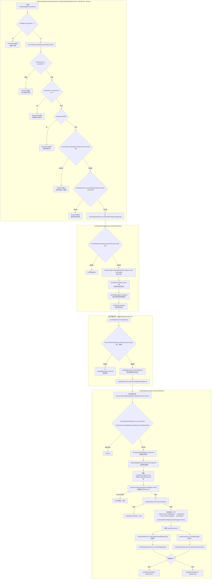

### 2.3 回复策略体系

**策略接口**：`service.reply.ReplyStrategy`
```java
public interface ReplyStrategy {
    ReplyResult execute(List<ChatMessageData> messageList);
    // ReplyResult 内嵌 ReplyItem: textContent / imageUrl / replyType
}
```

**策略解析器**：`service.reply.ReplyStrategyResolver.resolve()`

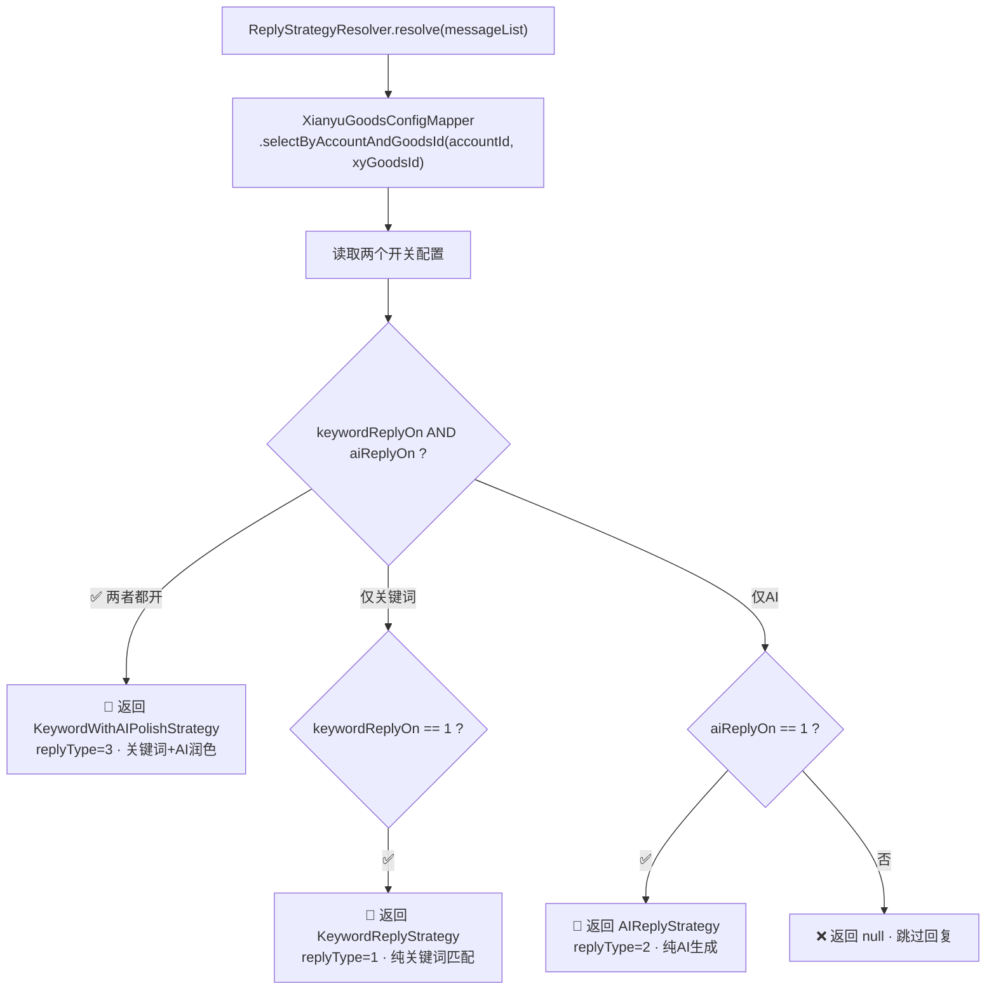

#### 策略一：KeywordReplyStrategy（纯关键词匹配）

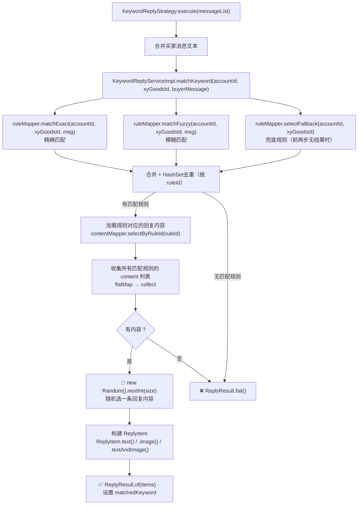

#### 策略二：AIReplyStrategy（纯 AI 生成）

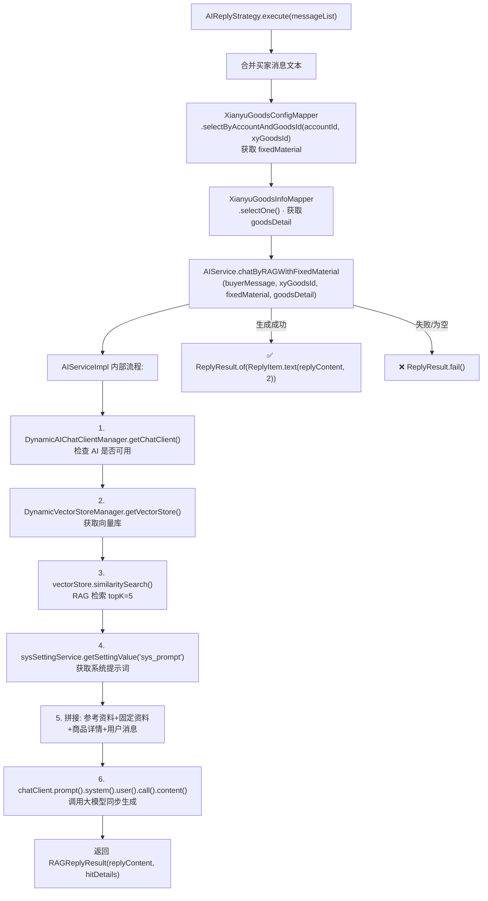

#### 策略三：KeywordWithAIPolishStrategy（关键词 + AI 润色）

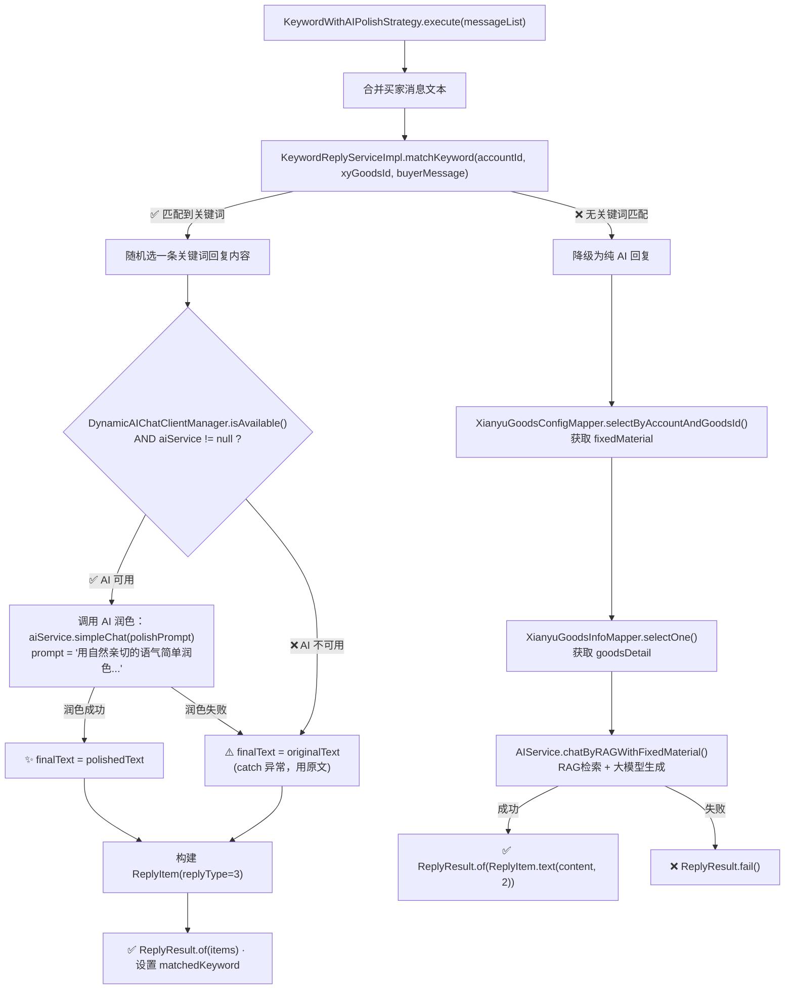

### 2.4 核心接口与实现类对照表

| 接口 | 实现类 | 关键方法 |
|------|--------|---------|
| `AutoReplyService` | `AutoReplyServiceImpl` | `executeAutoReply(List<ChatMessageData>)` |
| `AutoReplyDelayService` | `AutoReplyDelayServiceImpl` | `submitDelayTask(ChatMessageData)` · `cancelDelayTask(Long, String)` · `recordSellerManualReply(Long, String, String)` |
| `ReplyStrategy` | `KeywordReplyStrategy` | `execute(List<ChatMessageData>): ReplyResult` |
| `ReplyStrategy` | `AIReplyStrategy` | `execute(List<ChatMessageData>): ReplyResult` |
| `ReplyStrategy` | `KeywordWithAIPolishStrategy` | `execute(List<ChatMessageData>): ReplyResult` |
| `AIService` | `AIServiceImpl` | `chatByRAGWithFixedMaterial(String, String, String, String): RAGReplyResult` · `simpleChat(String): String` |
| `KeywordReplyService` | `KeywordReplyServiceImpl` | `matchKeyword(Long, String, String): List<KeywordReplyRuleBO>` |
| `AccountService` | `AccountServiceImpl` | `getXianyuUserId(Long): String` · `getCookieByAccountId(Long): String` |

### 2.5 延时调度数据结构

| 数据结构 | 类型 | Key | Value | 用途 |
|---------|------|-----|-------|------|
| `pendingTasks` | `ConcurrentHashMap<String, ScheduledFuture<?>>` | `accountId_sId` | 延时任务句柄 | 用于取消正在等待的延时任务 |
| `pendingMessages` | `ConcurrentHashMap<String, List<ChatMessageData>>` | `accountId_sId` | 延时期间收集的消息列表 | 合并多条消息一次性发给 AI |

---

## 三、自动发货（Auto Delivery）完整链路

### 3.1 类调用链总览

```
ChatMessageEventAutoDeliveryListener.handleChatMessageReceived()
  ├─→ isPaymentMessage(message)
  │    └─→ message.contentType == 26 && (msgContent.contains("[已付款，待发货]")
  │                                       || msgContent.contains("[我已付款，等待你发货]"))
  ├─→ resolveXianyuGoodsId(accountId, xyGoodsId)
  │    └─→ XianyuGoodsInfoMapper.selectOne()  // 根据闲鱼商品ID查本地ID
  ├─→ XianyuGoodsConfigMapper.selectByAccountAndGoodsId()  // 查开关
  ├─→ createOrderRecord(accountId, xianyuGoodsId, message)
  │    └─→ XianyuGoodsOrderMapper.insert()  // state=0 待发货
  └─→ AutoDeliveryService.executeDelivery()
       │
       ├─→ XianyuGoodsConfigMapper.selectByAccountAndGoodsId()  // 再次确认开关
       ├─→ OrderDetailFetcher.fetch(accountId, xyGoodsId, orderId)
       │    ├─→ AccountService.getCookieByAccountId(accountId)
       │    ├─→ XianyuApiCallUtils.callApiWithRetry(accountId, "mtop.taobao.idle.trade.merchant.full.info", dataMap, cookieStr)
       │    ├─→ parseBuyerInfo() / parseCommonData() / parseItemInfo() / parsePriceInfo()
       │    └─→ parseSkuInfo() → SkuResolver
       │         ├─→ SkuResolver.parseSkuInfoToValueText(skuInfoStr)  // "颜色:红色;尺码:XL" → "红色 XL"
       │         └─→ SkuResolver.resolveSkuIdByText(accountId, xyGoodsId, skuValueText)  // 匹配数据库SKU
       ├─→ XianyuGoodsOrderMapper.updateOrderDetail()  // 更新订单详情
       ├─→ XianyuGoodsAutoDeliveryConfigMapper (按SKU匹配或通用)
       │    ├─→ findByAccountIdAndGoodsIdAndSkuId()  // 优先SKU匹配
       │    └─→ findByAccountIdAndGoodsIdNoSku()     // 无SKU则通用
       ├─→ DeliveryStrategyResolver.resolve(deliveryMode, DeliveryContext)
       │    └─→ forEach DeliveryContentStrategy → strategy.supports(deliveryMode)
       │         ├─→ deliveryMode=1: TextDeliveryStrategy.resolve()
       │         └─→ deliveryMode=2: KamiDeliveryStrategy.resolve()
       ├─→ HumanLikeDelayUtils (mediumDelay/thinkingDelay/typingDelay)
       ├─→ WebSocketService.sendMessage(accountId, cid, toId, content)
       ├─→ SentMessageSaveService.saveAiAssistantReply()
       ├─→ XianyuGoodsOrderMapper.updateStateContentAndFailReason()
       └─→ [可选] executeAutoConfirmShipment()
            └─→ new Thread() → HumanLikeDelayUtils.longDelay()
                 └─→ OrderService.confirmShipment(accountId, orderId)
                      └─→ XianyuGoodsOrderMapper.updateConfirmState()
```

### 3.2 完整流程图（含方法名）

```mermaid
flowchart TD
    subgraph ListenerD["ChatMessageEventAutoDeliveryListener.handleChatMessageReceived() · @Async"]
        A["📩 收到 ChatMessageReceivedEvent"] --> B{"isPaymentMessage(message)"}
        B -->|"contentType ≠ 26"| B1["❌ return"]
        B -->|"不含 [已付款，待发货]"| B2["❌ return"]
        B -->|"✅ 是付款消息"| C{"xyGoodsId != null && sId != null ?"}
        C -->|null| C1["❌ log.warn 跳过"]
        C -->|有效| D["resolveXianyuGoodsId(accountId, xyGoodsId)<br/>→ XianyuGoodsInfoMapper.selectOne()"]
        D -->|找不到| D1["❌ log.warn 跳过"]
        D -->|找到| E["XianyuGoodsConfigMapper.selectByAccountAndGoodsId()"]
        E -->|"xianyuAutoDeliveryOn ≠ 1"| E1["❌ 未开启自动发货"]
        E -->|"已开启"| F["createOrderRecord()"]
    end

    subgraph CreateOrder["createOrderRecord()"]
        F --> F1["new XianyuGoodsOrder()"]
        F1 --> F2["set: accountId, xianyuGoodsId, xyGoodsId,<br/>pnmId, buyerUserId, buyerUserName,<br/>sId, orderId, state=0, confirmState=0"]
        F2 --> F3["XianyuGoodsOrderMapper.insert(record)"]
        F3 -->|UNIQUE冲突| F3a["❌ 已处理过，跳过"]
        F3 -->|成功| F4["✅ log.info 创建成功 → recordId"]
    end

    F4 --> G["🚀 AutoDeliveryService.executeDelivery<br/>(recordId, accountId, xyGoodsId, sId, orderId, buyerUserName, true)"]

    subgraph ExecDelivery["AutoDeliveryServiceImpl.executeDelivery()"]
        G --> G1["XianyuGoodsConfigMapper.selectByAccountAndGoodsId()<br/>再次确认开关"]
        G1 -->|未开启| G1a["updateRecordState(-1, null, '商品未开启自动发货')"]
        G1 -->|已开启| G2["📡 OrderDetailFetcher.fetch(accountId, xyGoodsId, orderId)"]
        G2 -->|失败/null| G2a["updateRecordState(-1, null, '获取订单详情失败')<br/>EmailNotifyService.sendAutoDeliveryFailEmail()"]
        G2 -->|成功| G3["解析 OrderDetailInfo:<br/>skuId, skuName, buyerUserName,<br/>orderCreateTime, paySuccessTime,<br/>consignTime, goodsTitle, totalPrice, buyNum"]
        G3 --> G4["orderMapper.updateOrderDetail()<br/>更新订单详情字段"]
        G4 --> G5{"orderSkuId != null ?"}
        G5 -->|有| G5a["autoDeliveryConfigMapper<br/>.findByAccountIdAndGoodsIdAndSkuId()<br/>按SKU匹配发货配置"]
        G5 -->|无/未匹配| G5b["autoDeliveryConfigMapper<br/>.findByAccountIdAndGoodsIdNoSku()<br/>通用发货配置"]
        G5a --> G6{"deliveryConfig == null ?"}
        G5b --> G6
        G6 -->|null| G6a["updateRecordState(-1, null, '无匹配的发货配置')"]
        G6 -->|找到| G7["构建 DeliveryContext{recordId, accountId,<br/>xyGoodsId, sId, orderId, buyerUserName, deliveryConfig}"]
        G7 --> G8["🔄 循环发货 buyNum 次"]
    end

    subgraph DeliveryLoop["发货循环 · for(int i=0; i<buyNum; i++)"]
        G8 --> H1["DeliveryStrategyResolver.resolve(deliveryMode, ctx)"]
        H1 --> H2["遍历 strategies → strategy.supports(deliveryMode)"]
        H2 --> H3{"deliveryMode ?"}
        H3 -->|"=1"| H4["TextDeliveryStrategy.resolve(ctx)<br/>直接返回 config.autoDeliveryContent"]
        H3 -->|"=2"| H5["KamiDeliveryStrategy.resolve(ctx)"]
        H4 --> H6{"content == null ?"}
        H5 --> H6
        H6 -->|null| H6a["updateRecordState(-1, null, failMsg)<br/>EmailNotifyService.sendAutoDeliveryFailEmail()"]
        H6 -->|有效| H7{"needHumanLikeDelay ?"}
        H7 -->|"true · i>0 先 thinkingDelay"| H8a["HumanLikeDelayUtils.thinkingDelay()"]
        H7 -->|"true · i==0 跳过"| H8b["HumanLikeDelayUtils.mediumDelay()<br/>.thinkingDelay()<br/>.typingDelay(content.length())"]
        H8a --> H8b
        H7 -->|false| H9["跳过延时"]
        H8b --> H10["WebSocketService.sendMessage<br/>(accountId, cid, toId, content)"]
        H9 --> H10
        H10 --> H10b["成功 && needHumanLikeDelay → thinkingDelay"]
        H10b --> H11["sendDeliveryImages()<br/>遍历并发送配置中的图片<br/>（无论文本发送成败都执行）"]
        H11 --> H12{"文本发送成功 ?"}
        H12 -->|成功| H13["SentMessageSaveService.saveAiAssistantReply()<br/>anySuccess = true<br/>allContent.append(content)"]
        H12 -->|"失败 · i==0（首轮）"| H12a["updateRecordState(-1, content, '消息发送失败')<br/>EmailNotifyService.sendAutoDeliveryFailEmail()<br/>❌ return 终止发货"]
        H12 -->|"失败 · i>0（非首轮）"| H12b["⚠️ break 退出循环<br/>（前面已有成功则不计为失败）"]
    end

    H13 -->|发货完成| I["updateRecordState(1, allContent, null)<br/>state=1 成功"]
    H12b -.->|break 后 anySuccess=true 则| I
    I --> J{"baseConfig.autoConfirmShipment == 1 ?"}
    J -->|是| K["executeAutoConfirmShipment(accountId, orderId)"]
    J -->|否| K1["结束"]
    K --> K2["new Thread().start()"]
    K2 --> K3["HumanLikeDelayUtils.longDelay()<br/>模拟人工等待"]
    K3 --> K4["OrderService.confirmShipment(accountId, orderId)<br/>调闲鱼API确认发货"]
    K4 -->|成功| K5["orderMapper.updateConfirmState()"]
    K4 -->|失败| K6["log.error"]
```

### 3.3 订单详情获取（OrderDetailFetcher）

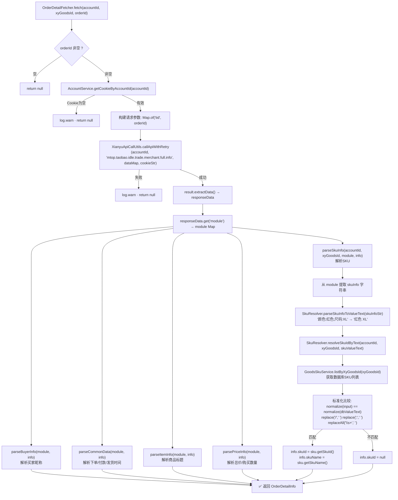

### 3.4 卡密发货详细流程（KamiDeliveryStrategy）

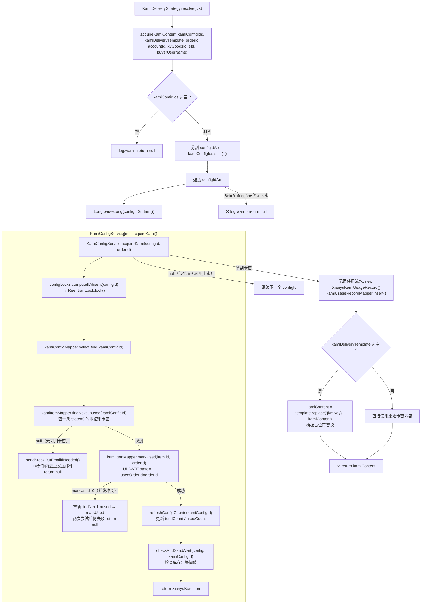

### 3.5 核心接口与实现类对照表

| 接口 | 实现类 | 关键方法 |
|------|--------|---------|
| `AutoDeliveryService` | `AutoDeliveryServiceImpl` | `executeDelivery(Long, Long, String, String, String, String, boolean)` |
| `DeliveryContentStrategy` | `TextDeliveryStrategy` | `supports(int): boolean` · `resolve(DeliveryContext): String` |
| `DeliveryContentStrategy` | `KamiDeliveryStrategy` | `supports(int): boolean` · `resolve(DeliveryContext): String` |
| `KamiConfigService` | `KamiConfigServiceImpl` | `acquireKami(Long, String): XianyuKamiItem` |
| `OrderService` | `OrderServiceImpl` | `confirmShipment(Long, String): String` · `getOrderDetail(Long, String): String` |
| `WebSocketService` | `WebSocketServiceImpl` | `sendMessage(Long, String, String, String): boolean` · `sendImageMessage(...): boolean` |

---

## 四、人工干预（Human Intervention）完整链路

### 4.1 类调用链总览

```
ChatMessageEventHumanInterventionListener.handleChatMessageReceived() · @Order(1) · @EventListener
  ├─→ message.contentType == 1 ?   // 只处理用户消息类型
  ├─→ AccountService.getXianyuUserId(accountId)  // 获取自己的闲鱼用户ID
  ├─→ senderUserId.equals(ownUserId) ?  // 判断是否为自己发送的消息
  └─→ AutoReplyDelayService.recordSellerManualReply(accountId, xyGoodsId, sId)
       │
       ├─→ ReplyConfigProvider.isHumanInterventionEnabled(accountId, xyGoodsId)
       │    └─→ XianyuGoodsConfigMapper.selectByAccountAndGoodsId()
       │         → config.humanInterventionOn == 1 ?
       ├─→ ReplyConfigProvider.getInterventionMinutes(accountId, xyGoodsId)
       │    → config.humanInterventionMinutes (默认10分钟)
       ├─→ HumanTakeoverManager.takeover(accountId, sId, minutes)
       │    └─→ takeoverMap.put(accountId_sId, System.currentTimeMillis() + minutes*60*1000)
       ├─→ cancelDelayTask(accountId, sId)  // 取消待执行延时任务
       └─→ pendingMessages.remove(accountId_sId)  // 清空待处理消息
```

### 4.2 完整流程图（含方法名）

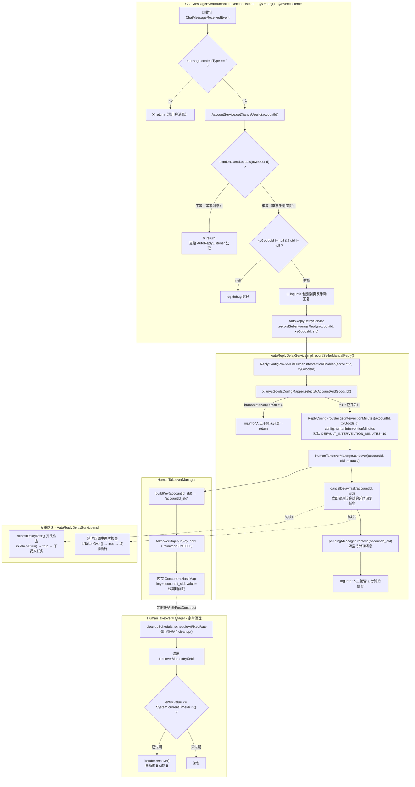

### 4.3 HumanTakeoverManager 核心实现

```java
// service.reply.HumanTakeoverManager
@Component
public class HumanTakeoverManager {
    // 接管状态: ConcurrentHashMap<"accountId_sId", 过期时间戳>
    private final ConcurrentHashMap<String, Long> takeoverMap = new ConcurrentHashMap<>();

    public void takeover(Long accountId, String sId, int minutes) {
        takeoverMap.put(accountId + "_" + sId,
            System.currentTimeMillis() + minutes * 60 * 1000L);
    }

    public boolean isTakenOver(Long accountId, String sId) {
        String key = accountId + "_" + sId;
        Long expireTime = takeoverMap.get(key);
        if (expireTime == null) return false;
        if (System.currentTimeMillis() > expireTime) {
            takeoverMap.remove(key, expireTime);  // 自动清理已过期
            return false;
        }
        return true;
    }

    @PostConstruct
    public void init() {
        // 定时清理：每分钟执行一次
        cleanupScheduler.scheduleAtFixedRate(this::cleanup, 1, 1, TimeUnit.MINUTES);
    }
}
```

### 4.4 ReplyConfigProvider 配置查询

```java
// service.reply.ReplyConfigProvider
@Component
public class ReplyConfigProvider {
    // 默认延时15秒
    public int getDelaySeconds(Long accountId, String xyGoodsId) {
        XianyuGoodsAutoDeliveryConfig config =
            autoDeliveryConfigMapper.findByAccountIdAndGoodsIdNoSku(accountId, xyGoodsId);
        return config != null ? config.getRagDelaySeconds() : DEFAULT_DELAY_SECONDS; // 15
    }

    // 人工干预开关
    public boolean isHumanInterventionEnabled(Long accountId, String xyGoodsId) {
        XianyuGoodsConfig config =
            goodsConfigMapper.selectByAccountAndGoodsId(accountId, xyGoodsId);
        return config != null && config.getHumanInterventionOn() == 1;
    }

    // 接管时长（分钟）
    public int getInterventionMinutes(Long accountId, String xyGoodsId) {
        XianyuGoodsConfig config =
            goodsConfigMapper.selectByAccountAndGoodsId(accountId, xyGoodsId);
        return config != null ? config.getHumanInterventionMinutes() : DEFAULT_INTERVENTION_MINUTES; // 10
    }
}
```

### 4.5 核心类关系

| 类 | 职责 |
|----|------|
| `ChatMessageEventHumanInterventionListener` | @Order(1) 最高优先级，检测卖家手动回复 |
| `AutoReplyDelayServiceImpl` | 入口 `recordSellerManualReply()`，串联接管流程 |
| `ReplyConfigProvider` | 读数据库配置（开关、分钟数） |
| `HumanTakeoverManager` | 内存接管状态管理 + 定时清理 |
| `AccountService` | 提供 `getXianyuUserId()` 用于判断消息发送者身份 |

---

## 五、关键词匹配（Keyword Matching）完整链路

### 5.1 类调用链

```
KeywordReplyService.matchKeyword(accountId, xyGoodsId, message)
  └── KeywordReplyServiceImpl.matchKeyword()
       ├─→ XianyuKeywordReplyRuleMapper.matchExact(accountId, xyGoodsId, msg)
       ├─→ XianyuKeywordReplyRuleMapper.matchFuzzy(accountId, xyGoodsId, msg)
       ├─→ 合并去重: HashSet<Long> matchedIds
       ├─→ 有匹配: contentMapper.selectByRuleId(ruleId) → 加载回复内容
       ├─→ 无匹配: ruleMapper.selectFallback(accountId, xyGoodsId) → 兜底规则
       └─→ 转换: toRuleBO(rule, contents) → List<KeywordReplyRuleBO>
```

### 5.2 详细流程图

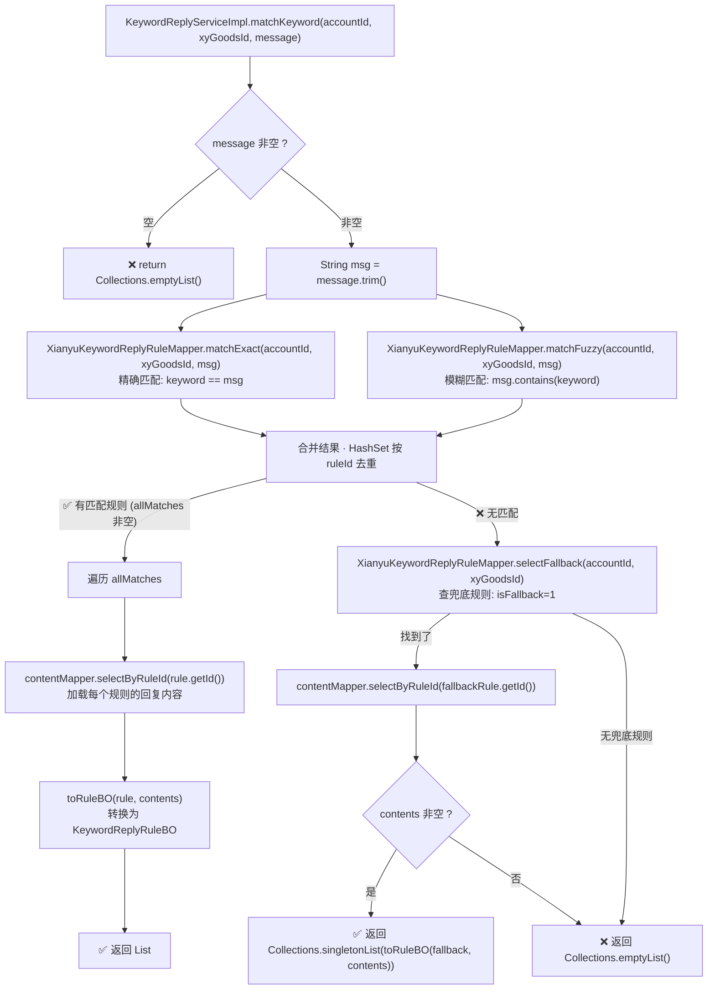

### 5.3 核心表与 Mapper

| 表 | Mapper | 说明 |
|----|--------|------|
| `xianyu_keyword_reply_rule` | `XianyuKeywordReplyRuleMapper` | 关键词规则：keyword, matchMode(1精确/2模糊), isFallback(0/1) |
| `xianyu_keyword_reply_content` | `XianyuKeywordReplyContentMapper` | 回复内容：replyText, replyImageUrl, 关联 ruleId |

---

## 六、完整关系图

### 6.1 数据库实体关系

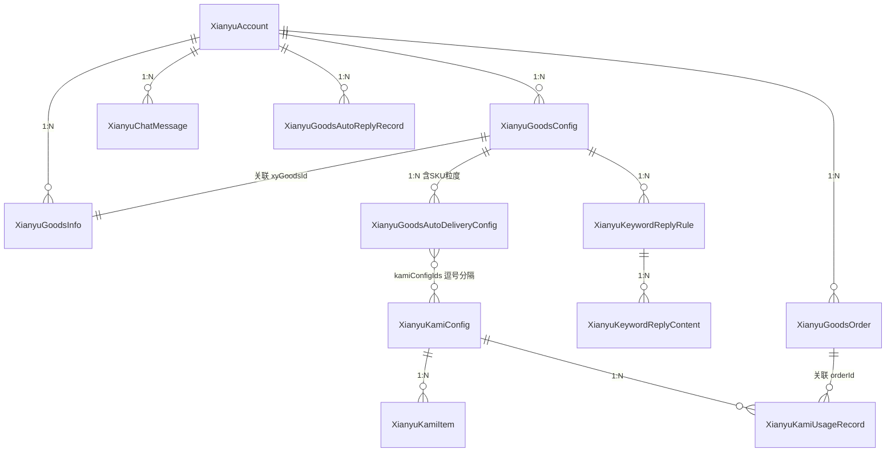

### 6.2 服务层依赖关系

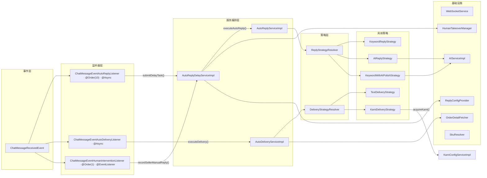

### 6.3 配置开关全景

每个商品通过 `XianyuGoodsConfig` + `XianyuGoodsAutoDeliveryConfig` 两张表控制行为：

| 配置字段 | 所在表 | 类型 | 说明 |
|---------|--------|------|------|
| `xianyuAutoReplyOn` | `XianyuGoodsConfig` | `Integer` (0/1) | AI 自动回复开关 |
| `xianyuKeywordReplyOn` | `XianyuGoodsConfig` | `Integer` (0/1) | 关键词回复开关 |
| `xianyuAutoDeliveryOn` | `XianyuGoodsConfig` | `Integer` (0/1) | 自动发货开关 |
| `humanInterventionOn` | `XianyuGoodsConfig` | `Integer` (0/1) | 人工干预开关 |
| `humanInterventionMinutes` | `XianyuGoodsConfig` | `Integer` | 人工干预持续分钟数（默认10） |
| `fixedMaterial` | `XianyuGoodsConfig` | `String` | AI 回复时携带的固定资料 |
| `ragDelaySeconds` | `XianyuGoodsAutoDeliveryConfig` | `Integer` | AI 回复延时秒数（默认15） |
| `deliveryMode` | `XianyuGoodsAutoDeliveryConfig` | `Integer` | 发货模式：1=文本 2=卡密 |
| `autoDeliveryContent` | `XianyuGoodsAutoDeliveryConfig` | `String` | 文本发货内容 |
| `autoDeliveryImageUrl` | `XianyuGoodsAutoDeliveryConfig` | `String` | 发货附带图片（逗号分隔多张） |
| `kamiConfigIds` | `XianyuGoodsAutoDeliveryConfig` | `String` | 绑定的卡密配置ID（逗号分隔） |
| `kamiDeliveryTemplate` | `XianyuGoodsAutoDeliveryConfig` | `String` | 卡密发货模板（含 {kmKey} 占位符） |
| `autoConfirmShipment` | `XianyuGoodsAutoDeliveryConfig` | `Integer` (0/1) | 自动确认发货开关 |

---

## 七、完整文件索引

| 层级 | 文件路径 | 核心职责 |
|------|---------|---------|
| **WebSocket客户端** | `websocket/XianyuWebSocketClient.java` | 单账号闲鱼长连接，收发消息 |
| **默认消息处理器** | `websocket/DefaultWebSocketMessageHandler.java` | 实现 WebSocketMessageHandler 接口，委托路由 |
| **消息路由器** | `websocket/WebSocketMessageRouter.java` | 按 lwp 路径分发到对应的 AbstractLwpHandler |
| **同步消息处理器** | `websocket/handler/SyncMessageHandler.java` | `/s/para` `/s/sync` 解密+解析JSON+发布事件 |
| **事件类** | `event/chatMessageEvent/ChatMessageReceivedEvent.java` | Spring 事件，携带 ChatMessageData |
| **事件数据** | `event/chatMessageEvent/ChatMessageData.java` | contentType/sId/xyGoodsId/msgContent 等 |
| **自动发货监听** | `event/chatMessageEvent/lister/ChatMessageEventAutoDeliveryListener.java` | contentType=26 付款消息 → 触发发货 |
| **自动回复监听** | `event/chatMessageEvent/lister/ChatMessageEventAutoReplyListener.java` | contentType=1 用户消息 → 触发延时回复 |
| **人工干预监听** | `event/chatMessageEvent/lister/ChatMessageEventHumanInterventionListener.java` | 卖家手动回复 → 触发接管 |
| **发货服务接口** | `service/AutoDeliveryService.java` | executeDelivery / handleAutoDelivery |
| **发货服务实现** | `service/impl/AutoDeliveryServiceImpl.java` | 发货流程编排核心 |
| **回复服务接口** | `service/AutoReplyService.java` | executeAutoReply / isAutoReplyEnabled |
| **回复服务实现** | `service/impl/AutoReplyServiceImpl.java` | 回复流程编排核心 |
| **延时调度服务接口** | `service/AutoReplyDelayService.java` | submitDelayTask / cancelDelayTask |
| **延时调度服务实现** | `service/reply/AutoReplyDelayServiceImpl.java` | 延时任务管理 + 双防线 |
| **回复策略接口** | `service/reply/ReplyStrategy.java` | execute → ReplyResult(含 ReplyItem) |
| **策略解析器** | `service/reply/ReplyStrategyResolver.java` | 根据开关选择策略 |
| **关键词策略** | `service/reply/KeywordReplyStrategy.java` | 纯关键词匹配回复 |
| **AI策略** | `service/reply/AIReplyStrategy.java` | 纯AI(RAG)生成回复 |
| **混合策略** | `service/reply/KeywordWithAIPolishStrategy.java` | 关键词+AI润色+AI降级 |
| **接管管理器** | `service/reply/HumanTakeoverManager.java` | 内存接管状态 ConcurrentHashMap |
| **配置提供者** | `service/reply/ReplyConfigProvider.java` | 延时秒数/干预开关/干预分钟数查询 |
| **发货策略接口** | `service/delivery/DeliveryContentStrategy.java` | supports(deliveryMode) / resolve(ctx) |
| **发货上下文** | `service/delivery/DeliveryContext.java` | @Builder 封装 recordId/accountId/xyGoodsId/sId/orderId 等 |
| **发货策略解析器** | `service/delivery/DeliveryStrategyResolver.java` | 遍历策略列表找匹配的 |
| **文本发货策略** | `service/delivery/TextDeliveryStrategy.java` | deliveryMode=1，直接返回配置文本 |
| **卡密发货策略** | `service/delivery/KamiDeliveryStrategy.java` | deliveryMode=2，扣减卡密+模板替换 |
| **订单详情获取** | `service/delivery/OrderDetailFetcher.java` | 调闲鱼API获取订单sku/金额等 |
| **SKU解析器** | `service/delivery/SkuResolver.java` | SKU文本标准化匹配 |
| **AI服务接口** | `service/AIService.java` | chatByRAGWithFixedMaterial / simpleChat |
| **AI服务实现** | `service/impl/AIServiceImpl.java` | RAG向量检索 + Spring AI ChatClient 调用 |
| **关键词服务接口** | `service/KeywordReplyService.java` | matchKeyword / addRule / 规则CRUD |
| **关键词服务实现** | `service/impl/KeywordReplyServiceImpl.java` | 精确匹配/模糊匹配/兜底规则 |
| **卡密服务接口** | `service/KamiConfigService.java` | acquireKami / 卡密CRUD |
| **卡密服务实现** | `service/impl/KamiConfigServiceImpl.java` | ReentrantLock 保证卡密扣减原子性 |
| **订单服务接口** | `service/OrderService.java` | confirmShipment / getOrderDetail |
| **账号服务接口** | `service/AccountService.java` | getCookieByAccountId / getXianyuUserId |
| **WebSocket服务接口** | `service/WebSocketService.java` | sendMessage / sendImageMessage |
| **消息入库服务** | `service/SentMessageSaveService.java` | saveAiAssistantReply / saveManualReply |
| **邮件通知服务** | `service/EmailNotifyService.java` | sendKamiStockOutEmail / sendAutoDeliveryFailEmail |
| **风控服务** | `service/impl/RiskControlServiceImpl.java` | detectRiskControl / isTokenExpired |
| **商品配置实体** | `entity/XianyuGoodsConfig.java` | 所有开关字段 |
| **发货配置实体** | `entity/XianyuGoodsAutoDeliveryConfig.java` | deliveryMode/skuId/kamiConfigIds等 |
| **触发上下文** | `entity/bo/AutoReplyTriggerContext.java` | 回复触发上下文（JSON存入DB） |

---

> 生成时间：2026-05-18 | 代码库：`com.feijimiao.xianyuassistant`